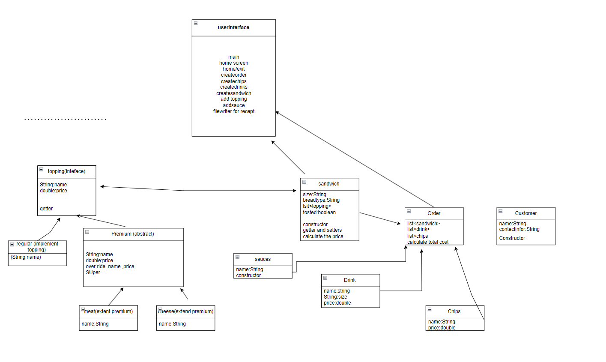
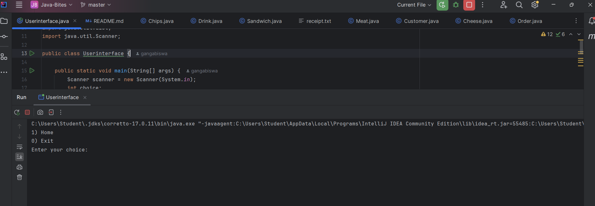

# Java-Bites

## Description of the Project
A console application called java-bites Ordering System is used to handle customer orders for sandwich shops.
to/your/class_diagram.png)

## User Stories

- As a user, I want to input sandwich customization options (bread type, size, toppings, sauces), so that I can create a personalized sandwich.
- As a user, I want to select drinks and chips, so that I can complete my order.
- As a user, I want to generate a receipt with all order details and prices, so that I can have a record of my purchase.
- As a user, I want to add multiple sandwiches to my order, so that I can place a larger order at once.

## Setup

- Open IntelliJ IDEA.
- Select "Open" and navigate to the directory where you cloned or downloaded the project.
- After the project opens, wait for IntelliJ to index the files and set up the project.
- Find the main class with the public static void main(String[] args) method.
- Right-click on the file and select 'Run 'YourMainClassName.main()'' to start the application.

### Prerequisites

- IntelliJ IDEA: Ensure you have IntelliJ IDEA installed, which you can download from [here](https://www.jetbrains.com/idea/download/).
- Java SDK: Make sure Java SDK is installed and configured in IntelliJ.

### Running the Application in IntelliJ

Follow these steps to get your application running within IntelliJ IDEA:

1. Open IntelliJ IDEA.
2. Select "Open" and navigate to the directory where you cloned or downloaded the project.
3. After the project opens, wait for IntelliJ to index the files and set up the project.
4. Find the main class with the main method.
5. Right-click on the file and select 'Run 'YourMainClassName.main()'' to start the application.

## Technologies Used

- Java: Version 17.
- No additional libraries or frameworks used in the project.

## Resources

List resources such as tutorials, articles, or documentation that helped you during the project.

## Thanks

Express gratitude towards those who provided help, guidance, or resources:

- Thank you to [Raymond] for continuous support and guidance.
- A special thanks to Husnain and all the classmates for the help.
